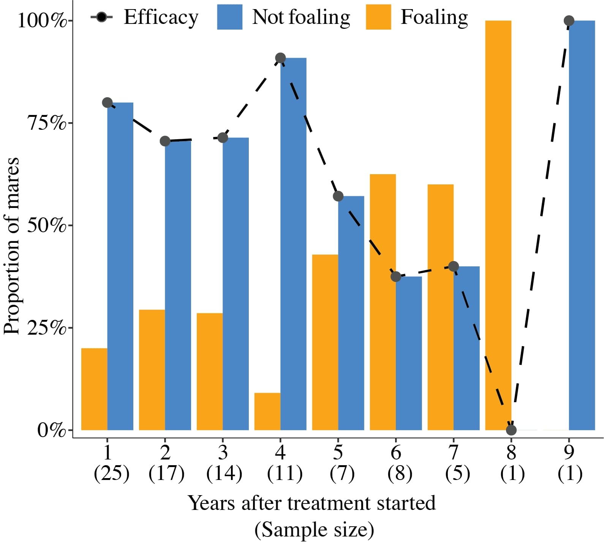

# Efficacy and reversibility of PZP fertility control in Przewalski's horses
Code and main results for the project assessing the results & implications of Porcine Zona Pellucida contraception as a management protocol in the Przewalski's horse herd of Hortobágy, Hungary.

## Summary of the project
Populations of large grazers, such as horses or deer often live in areas with no or limited predation, which can lead to unsustainable population growth, reduced individual health and escalating human-wildlife conflicts. Therefore, managers are often required to intervene to reduce the number of individuals. Culling, however, is a controversial and at times unfeasible method. Fertility control, such as PZP, offers a viable, humane alternative to manage these populations, but its efficacy and long-term effects under field conditions are underexplored. 
In this project, I report the results of 9 years (2013-2023) of PZP management in a Przewalski's horse (Equus ferus przewalskii) herd. The population lives in an enclosed area, making population control necessary, however, as the species is endangered, it is important that the method is reversible and causes minimal disturbance to the animals. 
The results show that the recommended 2-year treatment might be too long for this population / species, and leads to prolonged infertility of >6 years, which is an undesirable effect. However, an 1-year reatment course offers a promising alternative; with high initial efficacy for 4 years and a greater return to fertility. We also show that for the treatment to be effective already in the first year, the doses need to be administered well before the breeding season starts.

## Key Figures

### The standard 2-year treatment leads to high efficacy, but a limited return to fertility.

Figure 3. Yearly efficacy of PZP treatment in mares treated for two years (receiving the primer dose and two boosters). Year 1 corresponds to the first foaling season following the administration of the primer dose. Note that the years indicated on the plot do not align with calendar years, as treatment initiation date varied across individuals. 

### An alternative, shorter treatment course can also achieve high efficacy, with more horses returning to fertility!

Figure 4. Yearly efficacy of PZP treatment in mares treated for one year (receiving the primer dose and one booster). Year 1 corresponds to the first foaling season following the administration of the primer dose. As for Figure 3, the years shown on the plot do not align with calendar years. 

### Administering the first two doses before breeding activity is essential for the vaccine to take effect in the first year

The efficacy of PZP vaccines in the first year post-treatment for mares with different inoculation timingsfor the two initial doses.

## Administration of PZP in practice

